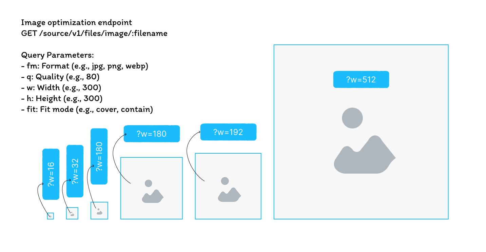

## Introduction



This project is an Image Optimization Service built using Node.js and Express. It leverages the Sharp library to perform image transformations such as format conversion, resizing, and quality adjustments. The service is designed to efficiently serve optimized images based on client requests, improving load times and reducing bandwidth usage.

## Features
- Dynamic image format conversion (e.g., JPEG, PNG, WebP, AVIF)
- Image resizing capabilities
- Quality adjustment for optimized images
- Caching mechanism to store and retrieve optimized images
- Configurable source directories for image retrieval

## Folder Structure

```diff
IMAGES-OPTIMIZE-SERVICE
├───.cache-local
├───src
│   ├───controllers
│   └───utils
└───storage
    ├───example
    │   └───kopy
    │       └───foldername
    ├───customize-upload-names-1
    └───customize-upload-names-2
```


## Getting Started

### Prerequisites
- Node.js (version 18 or higher)
- npm (Node Package Manager)

### Installation
1. Clone the repository:

```bash
git clone https://github.com/pphatdev/cdn.api.pphat.stackdev.cloud.git
```

2. Navigate to the project directory:
```bash
cd cdn.api.pphat.stackdev.cloud
```

3. Install the dependencies:
```bash
npm install
```

### Configuration
1. Create a configuration file (e.g., `env.json`) in the root directory to specify source directories and other settings.
2. Define the source directories where images are stored.

### Example `env.json`:
```json
{
    "directories": [
        "./assets/**/**"
    ],
    "port": 3101
}
```

### Development
To run the service in development mode with automatic restarts on file changes, use:
```bash
npm run dev
```

### Build

After building the project, the compiled files will be located in the `dist` directory as ES modules.

To build the project, run:
```bash
npm run build
```

### Running the Service
Start the server using the following command:
```bash
npm start
```


The server will start on the configured port (default is 3000). You can access the service at `http://localhost:3000`.


## Process Flow

<div style="text-align: center; padding: 20px; background-color: #121212;">
    
    
</div>